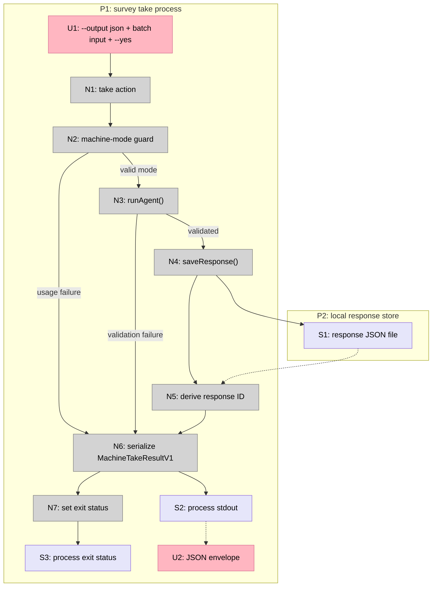

# Agent machine output

Status: selected and ready for one implementation slice

## Source

> A( dale y publica shape north en el orden que digas

Selected direction:

> Make agent mode a stable machine protocol. Add an explicit machine-output option to `take` that emits one uncolored JSON envelope for success and failure, suppresses summary UI, and includes the saved response identity.

## Repository evidence

- `src/cli.ts` accepts agent answers through `--answers` and stdin JSON, then sends successful batches through `showSummary()` and prints a colored path.
- `src/runner/agent.ts` already returns structured success, validation errors, and the visited question path.
- `src/runner/summary.ts` renders a Clack note even when `--yes` skips confirmation.
- `src/storage.ts` returns the saved response path, which already carries a stable response timestamp.
- The published `0.0.1` package predates current `main`; releasing current local-first work is an operational prerequisite, not part of this feature slice.

## Direction decision

| Direction | Decision | Reason |
|---|---|---|
| A: Stable machine protocol | Selected | Strengthens the existing agent-friendly promise and unlocks later agent workflows without a backend. |
| B: Incremental conditional sessions | Rejected for now | Session versioning, expiry, and concurrency expand the state model before the stateless contract is reliable. |
| C: Local response summaries | Rejected for now | Valuable for authors, but it does not fix the current agent integration boundary. |
| D: JSON response import | Rejected for now | Portability matters, but collision and validation policy should follow a stable output contract. |
| E: `/survey-fill` skill | Rejected for now | The skill should consume a dependable machine protocol instead of parsing human terminal output. |

## Frame

### Problem

- Agent batch mode accepts structured input but does not return structured output.
- Successful automation receives terminal presentation and a raw path instead of a versioned result contract.
- Validation failures are structured internally but flattened into human stderr lines.
- Reusing the current output requires brittle ANSI stripping and text parsing.

### Outcome

- Explicit machine mode emits exactly one parseable JSON document.
- Success identifies the survey and saved response without echoing submitted answers.
- Validation and supported usage failures are structured and exit non-zero.
- Existing human output remains unchanged by default.

## Requirements

| ID | Requirement | Status |
|---|---|---|
| R0 | Agent batch submission returns exactly one parseable JSON document on stdout. | Core goal |
| R1 | Successful output identifies the survey, response, and visited question path without echoing submitted answers. | Must-have |
| R2 | Validation and supported usage failures return a versioned JSON error and a non-zero exit status. | Must-have |
| R3 | Machine output contains no ANSI styling, Clack summary, prompts, or unrelated log lines. | Must-have |
| R4 | Machine output is an explicit opt-in and existing human behavior remains the default. | Must-have |
| R5 | Machine submission remains batch-only and requires explicit `--yes` authorization before writing a response. | Must-have |
| R6 | Successful machine submission uses the existing local response store and preserves its persistence semantics. | Must-have |
| R7 | The output contract, default human path, and no-write failure path have deterministic tests. | Must-have |
| R8 | README and landing command references describe the shipped machine contract consistently. | Must-have |
| R9 | The slice introduces no backend, telemetry, model provider, session persistence, analytics, import, or synchronization. | Out boundary |
| R10 | The slice does not break existing exported library APIs. | Must-have |

## A: Explicit output mode on `survey take`

| Part | Mechanism | Flag |
|---|---|:---:|
| A1 | Add `--output <format>` to `survey take`; default to the existing human path and accept `json` as the first machine format. | |
| A2 | Permit JSON output only with `--answers` or stdin `--json`, and require `--yes` before persistence. | |
| A3 | Define a versioned success envelope containing `surveyId`, `responseId`, `responsePath`, and `visited`, without submitted answers. | |
| A4 | Define versioned error envelopes for invalid JSON, invalid mode combinations, missing surveys, and answer validation failures. | |
| A5 | Route machine success and failure around `showSummary()` so stdout contains one uncolored JSON document and exit status carries success or failure. | |
| A6 | Preserve `runAgent()` and `saveResponse()` semantics; derive the response identity from the saved path without changing public exports. | |
| A7 | Add focused CLI contract tests plus README and landing command parity. | |

## Fit Check

| Req | Requirement | Status | A |
|---|---|---|:---:|
| R0 | Agent batch submission returns exactly one parseable JSON document on stdout. | Core goal | ✅ |
| R1 | Successful output identifies the survey, response, and visited question path without echoing submitted answers. | Must-have | ✅ |
| R2 | Validation and supported usage failures return a versioned JSON error and a non-zero exit status. | Must-have | ✅ |
| R3 | Machine output contains no ANSI styling, Clack summary, prompts, or unrelated log lines. | Must-have | ✅ |
| R4 | Machine output is an explicit opt-in and existing human behavior remains the default. | Must-have | ✅ |
| R5 | Machine submission remains batch-only and requires explicit `--yes` authorization before writing a response. | Must-have | ✅ |
| R6 | Successful machine submission uses the existing local response store and preserves its persistence semantics. | Must-have | ✅ |
| R7 | The output contract, default human path, and no-write failure path have deterministic tests. | Must-have | ✅ |
| R8 | README and landing command references describe the shipped machine contract consistently. | Must-have | ✅ |
| R9 | The slice introduces no backend, telemetry, model provider, session persistence, analytics, import, or synchronization. | Out boundary | ✅ |
| R10 | The slice does not break existing exported library APIs. | Must-have | ✅ |

## Detail A: Breadboard

### Places

| # | Place | Description |
|---|---|---|
| P1 | `survey take` process | One CLI invocation from parsed options through observable output and exit status. |
| P2 | Local response store | Existing `SURVEY_CLI_HOME` response directory. |

### UI affordances

| # | Place | Component | Affordance | Control | Wires Out | Returns To |
|---|---|---|---|---|---|---|
| U1 | P1 | Commander command | `--output json` with batch input and `--yes` | invoke | → N1 | None |
| U2 | P1 | stdout | One JSON success or error envelope | display | None | None |

### Code affordances

| # | Place | Component | Affordance | Control | Wires Out | Returns To |
|---|---|---|---|---|---|---|
| N1 | P1 | `buildProgram()` | `take` action | call | → N2 | None |
| N2 | P1 | machine-mode guard | Validate format, batch input, and `--yes` | call | → N3 or N6 | None |
| N3 | P1 | agent runner | `runAgent()` | call | → N4 on success or N6 on failure | None |
| N4 | P1 | storage | `saveResponse()` | call | → S1, → N5 | None |
| N5 | P1 | response identity | Derive response ID from saved path | call | → N6 | None |
| N6 | P1 | machine renderer | Serialize `MachineTakeResultV1` once | call | → S2, → N7 | None |
| N7 | P1 | process | Set success or failure exit status | call | → S3 | None |

### Data stores

| # | Place | Store | Description | Returns To |
|---|---|---|---|---|
| S1 | P2 | Response JSON file | Existing persisted response written only after successful validation. | → N5 |
| S2 | P1 | Process stdout | Exactly one uncolored JSON document in machine mode. | → U2 |
| S3 | P1 | Process exit status | Zero for success and non-zero for supported machine failures. | → caller |



## Slice

| # | Slice | Mechanism | Affordances | Demo |
|---|---|---|---|---|
| V1 | Deterministic agent submission result | A1-A7 | U1-U2, N1-N7, S1-S3 | Run one valid and one invalid batch submission, parse both outputs as JSON, observe the saved response only for success, and confirm the default human output remains unchanged. |

V1 is the complete feature. Splitting the formatter, CLI option, or tests into separate pull requests would create horizontal slices without an independently useful outcome.

## V1 issue contract

### In scope

- Add explicit JSON output to batch `survey take`.
- Emit one versioned success or error envelope.
- Preserve local persistence and return response identity on success.
- Preserve the current human path when machine output is absent.
- Add focused regression tests and README/landing command parity.

### Out of scope

- Interactive JSON mode.
- Partial or persistent agent sessions.
- Returning submitted answers in the result.
- New storage formats or public library API changes.
- Backend, dashboard, telemetry, analytics, import, synchronization, `/survey-fill`, or release automation.

### Acceptance

- A valid batch command with `--output json --yes` writes one response, emits one ANSI-free JSON document, and exits zero.
- The success document includes `schemaVersion: 1`, `ok: true`, `surveyId`, `responseId`, `responsePath`, and `visited`.
- Invalid answer data emits one ANSI-free JSON document with `schemaVersion: 1`, `ok: false`, structured validation errors, and a non-zero exit status without writing a response.
- Invalid JSON, missing survey, missing batch input, and missing `--yes` produce structured machine errors once `--output json` has been selected.
- Existing human interactive and batch output remains unchanged when `--output json` is absent.
- Focused CLI tests parse stdout with `JSON.parse`, assert stderr and ANSI boundaries, assert exit status, and verify the success-only filesystem effect.
- README and the landing command table show the exact shipped invocation.

### Verification

```bash
bun test
bun run typecheck
bunx biome check src test bin package.json tsconfig.json biome.json
```
